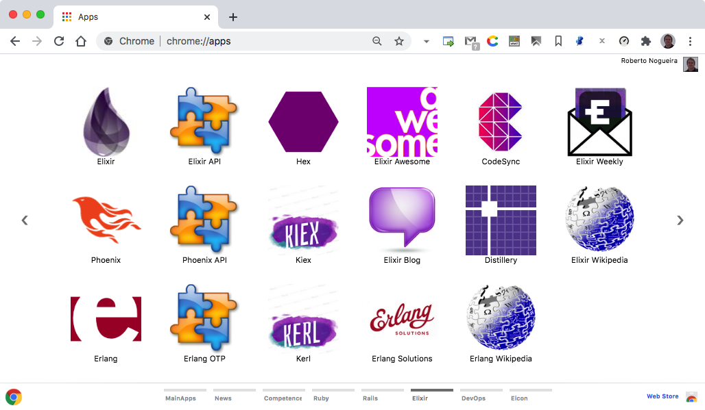
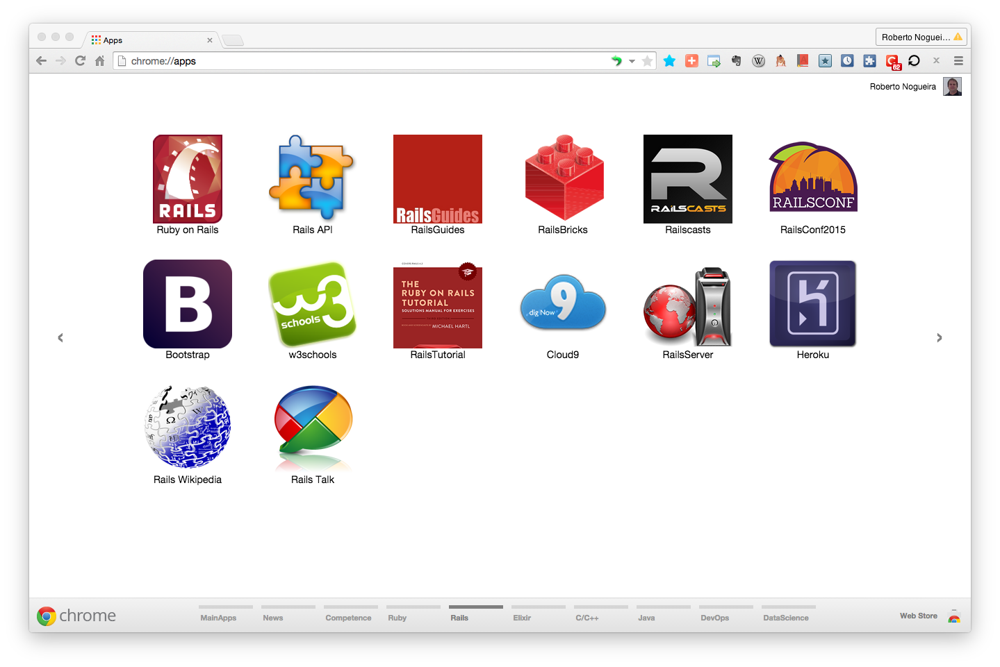

# Chrome Apps for Rails


## Installation

### 1. Clone this repository and see its contents.
Open a terminal give the following command:

```bash
$ git clone https://github.com/enogrob/ChromeApps_Rails.git
```

As we can see a subdirectory is created for each Rails app.

```bash
[TODAY (master)]$ ls -la
total 40
drwxr-xr-x@   8 enogrob  staff   272B Apr 26 23:35 ./
drwxr-xr-x+ 138 enogrob  staff   4.6K Apr 26 05:51 ../
-rw-r--r--@   1 enogrob  staff   6.0K Apr 25 01:26 .DS_Store
-rw-r--r--    1 enogrob  staff     7B Apr 25 01:26 .ruby-gemset
-rw-r--r--    1 enogrob  staff    11B Apr 25 01:26 .ruby-version
-rw-r--r--    1 enogrob  staff     0B Apr 25 11:17 20150202_202034_localhost.log
drwxr-xr-x   21 enogrob  staff   714B Apr 26 23:40 ChromeApps_Rails/
-rw-r--r--    1 enogrob  staff   139B Apr 26 23:35 today_data.yaml

$ tree -L 1 ChromeApps_Rails/
ChromeApps_Rails/
├── README.md
├── Rails-API
├── Rails-APIdock-RSpec
├── Rails-Bootstrap
├── Rails-Capistrano
├── Rails-Cloud9
├── Rails-GoogleGroups
├── Rails-Heroku
├── Rails-Homepage
├── Rails-Nitrous
├── Rails-RailsBricks
├── Rails-RailsConf2014
├── Rails-RailsConf2015
├── Rails-RailsGuides
├── Rails-RailsServer
├── Rails-RailsTutorial
├── Rails-RailsWikipedia
├── Rails-Railscasts
├── Rails-GoRails
├── Rails-w3schools
└── images

20 directories, 1 file
$
```

### 2. Open Chrome with the following url:
In order to load the `Chrome Apps` for Ruby, check `Developer Mode` and press `Load unpacked extension...` to load each App selecting its corresponding directory inside `ChromeApps_Rails` e.g. `Rails-Homepage`, and then repeat that for the wanted apps.

```
chrome://extensions/
```



### 3. After load the Chrome Apps wanted for Rails, Chrome will look like the screenshot below:

