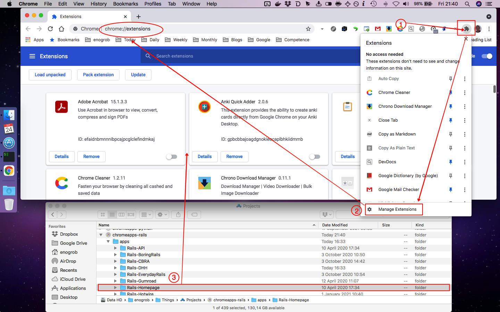

# Chrome Apps for Rails

Gather Rails important references and shortcuts in form of Chrome Apps.


## Installation

### 1. Clone this repository and see its contents.
Open a terminal give the following command:

```bash
$ git clone https://github.com/enogrob/chromeapps-rails.git
$ cd chromeapps-rails
```

As we can see a subdirectory is created for each Rails app.

```bash
$ ls -la
total 400
drwxr-xr-x@   8 enogrob  staff    272 Oct  4 02:43 .
drwxr-xr-x@ 298 enogrob  staff  10132 Oct  4 02:41 ..
drwxr-xr-x   13 enogrob  staff    442 Oct  4 02:46 .git
-rw-r--r--    1 enogrob  staff      5 Oct  4 02:42 .gitignore
-rw-r--r--@   1 enogrob  staff      0 Oct  4 02:43 Icon?
-rw-r--r--@   1 enogrob  staff    856 Oct  4 02:44 README.md
drwxr-xr-x   19 enogrob  staff    646 Oct  4 02:42 apps
drwxr-xr-x    4 enogrob  staff    136 Oct  4 02:46 images

$ tree -L 1 apps/
apps
├── Rails-API
├── Rails-BoringRails
├── Rails-CBRA
├── Rails-DHH
├── Rails-EverydayRails
├── Rails-Gumroad
├── Rails-Homepage
├── Rails-Hotwire
├── Rails-Kuby
├── Rails-MailCatcher
├── Rails-MiniTest
├── Rails-OpenSourceRails
├── Rails-RSpec
├── Rails-RailsBump
├── Rails-RailsBytes
├── Rails-RailsConf
├── Rails-RailsDiscuss
├── Rails-RailsGuides
├── Rails-RailsNew
├── Rails-RailsWikipedia
├── Rails-RubyOnRailsBosnia
├── Rails-RubyOnRailsPodcast
├── Rails-StimulusReflex
├── Rails-TechMaker
├── Rails-Trailblazer
├── Rails-Upcase
└── Rails-Webpack

27 directories, 0 files

# in order to open Files in "Linux" to drag the App folders if wanted.
$ cd apps
$ xdg-open .&
```

### 2. Open Chrome with the following url:
In order to load the `Chrome Apps` for Rails, check `Developer Mode` and press `Load unpacked extension...` to load each App selecting its corresponding directory inside `apps` e.g. `Rails-Homepage`, and then repeat that for the wanted apps. 


Or just drag and drop the app folder on the [Extensions page](chrome://extensions).



### 3. After load the Chrome Apps wanted for Rails, Chrome will look like the screenshot below:


Pressione the Chrome "Apps" button and then look for the ones you have inserted. You can drag as you want in order to put them in desired order.