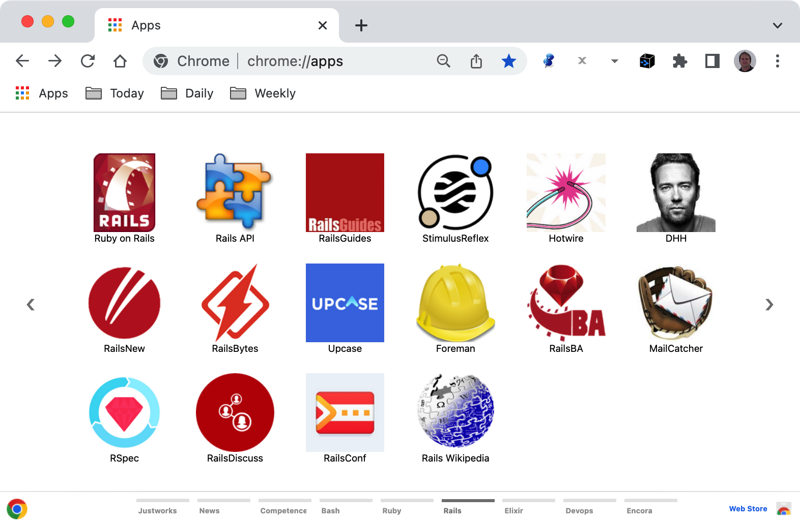

# Chrome Apps for Elixir


## Installation

### 1. Clone this repository and see its contents.
Open a terminal give the following command:

```bash
$ git clone https://github.com/enogrob/chromeapps-elixir.git
```

As we can see a subdirectory is created for each Elixir app.

```bash
$ ls -la
total 984
drwxr-xr-x@  10 enogrob  staff    340 Oct  3 16:42 .
drwxr-xr-x@ 298 enogrob  staff  10132 Oct  4 02:29 ..
-rw-r--r--@   1 enogrob  staff   6148 Oct  3 16:58 .DS_Store
drwxr-xr-x   14 enogrob  staff    476 Oct  3 16:54 .git
-rw-r--r--    1 enogrob  staff      5 May 31  2016 .gitignore
drwxr-xr-x   10 enogrob  staff    340 Nov 17  2016 .idea
-rw-r--r--@   1 enogrob  staff      0 Nov 17  2016 Icon?
-rw-r--r--@   1 enogrob  staff   1892 Oct  4 02:33 README.md
drwxr-xr-x   19 enogrob  staff    646 Oct  4 02:31 apps
drwxr-xr-x    4 enogrob  staff    136 Oct  4 02:32 images

$ tree -L 1 apps/
apps
├── Elixir-Awesome
├── Elixir-Blog
├── Elixir-CodeSync
├── Elixir-Distillery
├── Elixir-ElixirAPI
├── Elixir-ElixirWeely
├── Elixir-ElixirWikipedia
├── Elixir-Erlang
├── Elixir-ErlangOTP
├── Elixir-ErlangSolutions
├── Elixir-ErlangWikipedia
├── Elixir-Hex
├── Elixir-Homepage
├── Elixir-Kerl
├── Elixir-Kiex
├── Elixir-Phoenix
└── Elixir-PhoenixAPI

17 directories, 0 files
$
```

### 2. Open Chrome with the following url:
In order to load the `Chrome Apps` for Eicon, check `Developer Mode` and press `Load unpacked extension...` to load each App selecting its corresponding directory inside `apps` e.g. `Elixir-Homepage`, and then repeat that for the wanted apps.

```
chrome://extensions/
```

### 3. After load the Chrome Apps wanted for Elixir, Chrome will look like the screenshot below:

